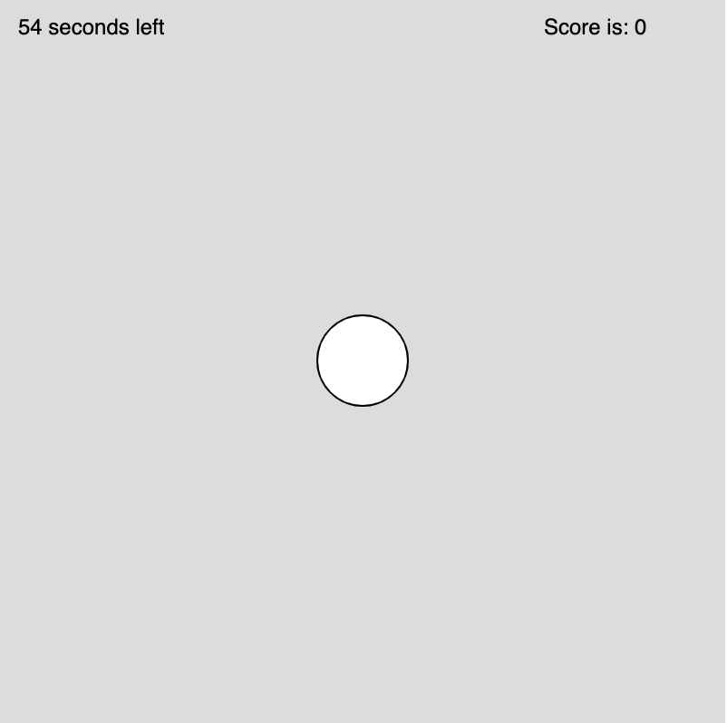
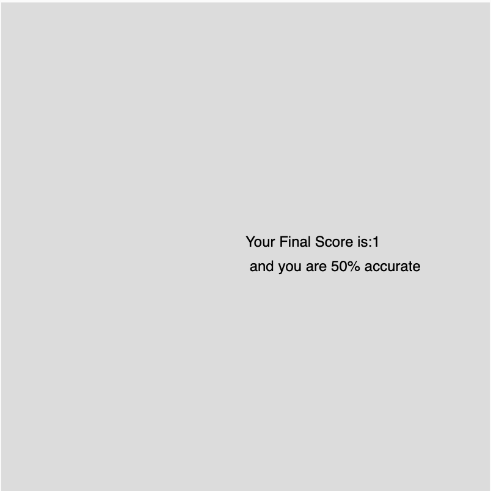

# P5.js Shooting Game

## Game Process

This Game sets an initial timer of 60 seconds and once the user clicks the `Start Game` button, 

the timer will start and user shall shoot as many eclipse as possible within the given time. 

By the end of the game, the program will show the resulting score and accuracy of this round.

## Implementation

- This game uses P5.js to implment its functionality.

## For Online and most updated experience:
[Check out this link for Shooting Game p5.js Web Editor](https://editor.p5js.org/chen-jin021/sketches/Uz1-2oF9M)
